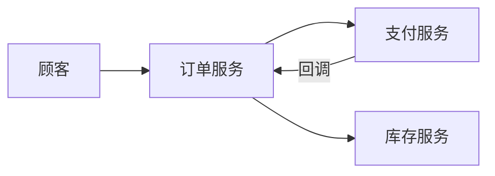

## 总图

```mermaid
flowchart LR
  customer[顾客] --> order_service[订单服务]
  order_service --> payment[支付服务]
  payment -->|回调| order_service
  order_service --> inventory[库存服务]
```
导览：[[order-service]] · [[domain_rules#ORD-1]]
