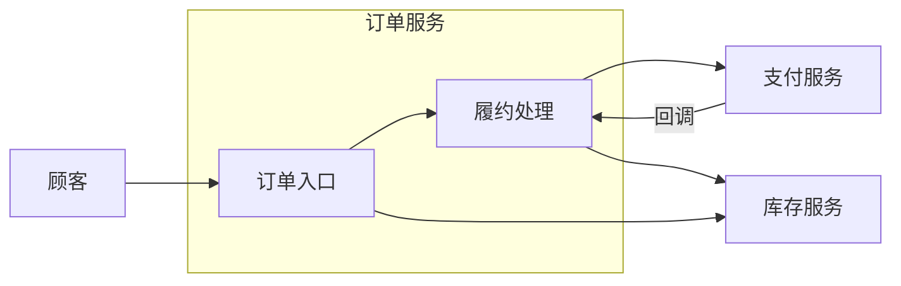

## 组件

```mermaid
flowchart LR
  subgraph order_service[订单服务]
    api[订单入口] --> worker[履约处理]
  end
  customer[顾客] --> api
  worker --> payment[支付服务]
  payment -->|回调| worker
  worker --> inventory[库存服务]
  api --> inventory
```

## [ORD-2] 边界门规
关联：[[domain_rules#ORD-1]]
- **对外开口**：下单、取消、支付回调。
- **唯一记忆事实**：订单状态和已处理支付凭据。
- **死守底线**：取消后不再成交。
  - **反例**：取消后收到旧支付回调，订单又变成已成交。
- **外部默认前提**：旧请求会晚到，上游会重试。
